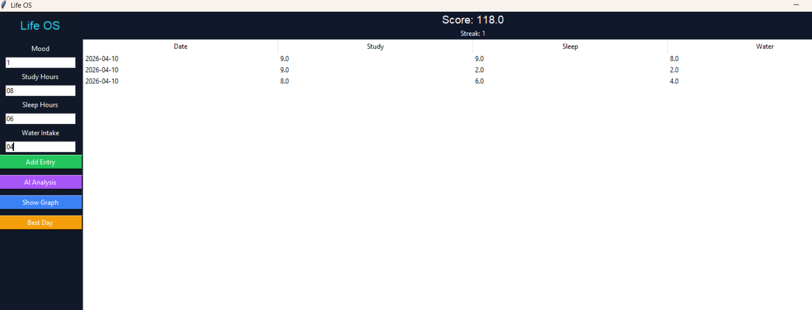

# 🚀 Life OS - AI Productivity System

An advanced AI-based life tracking system that analyzes daily habits and provides intelligent insights.

## 🔥 Features
- 🧠 AI Life Analyzer (pattern detection & prediction)
- 📊 Productivity Score System
- 🔥 Streak Tracking
- 🏆 Best Day Detection
- 📈 Graph Visualization
- 💬 Smart Feedback System

## 🛠 Tech Stack
- Python
- Tkinter
- SQLite
- Matplotlib

## 💡 What Makes It Unique
Unlike basic trackers, this system analyzes user behavior trends and gives intelligent feedback like a real AI assistant.

## 🚀 Future Scope
- Web App Version
- Real AI Integration
- Mobile App

